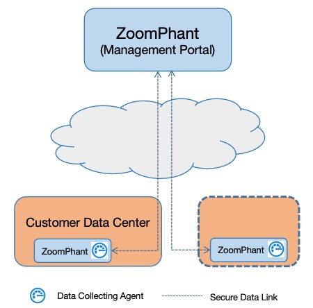
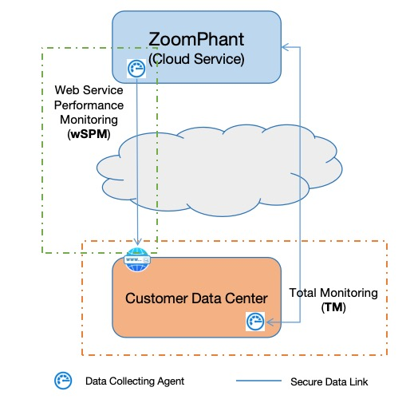

# How ZoomPhant Works

---
Like any comprehensive monitoring solution, ZoomPhant performs all the key tasks required to monitor your systems:

* **Data Collection**: Collects data from various sources, including structured data (metrics) and semi-structured data (logs, traces, and events).
* **Data Storage**: Stores data in a time-series database. The Community Version is backed by a Prometheus-compatible database, ensuring all data is saved in standard, open formats.
* **Processing & Presentation**: Processes and displays data using feature-rich, interactive widgets.
* **Alerting & Notifications**: Uses a proprietary engine to process time-series data in real-time, allowing users to define multi-stage notifications via email, SMS, voice calls, or webhooks.
* **Configuration Management**: Provides well-organized interfaces for managing monitored objects and devices.
* **Plugins**: Offers a wide range of plugins for monitoring various infrastructures, software, and services. ZoomPhant natively supports Prometheus exporters and will feature a plugin marketplace for sharing custom integrations.

Depending on your deployment model, the diagrams below provide a high-level overview of how ZoomPhant operates:

## Local/On-Premises Deployment

We highly recommend local deployment, which is currently the default and only option available for the Community Version.

In a local deployment, all ZoomPhant functions run directly within your own data center. This ensures full data sovereignty and eliminates outbound bandwidth charges.

Paid customers can connect their local installations to the ZoomPhant Cloud to enable advanced features like automatic system upgrades, SMS/voice notifications, and centralized plugin management.

## SaaS Cloud Service

ZoomPhant will also offer a traditional SaaS cloud service, allowing users to register and start monitoring immediately by installing data collection agents.

To use the cloud service, you install one or more collection agents in your environments to report metrics and logs to ZoomPhant Cloud. Additionally, the cloud service offers advanced external monitoring capabilities, such as Web Service Performance Monitoring (wSPM), to track the availability and speed of your business websites.