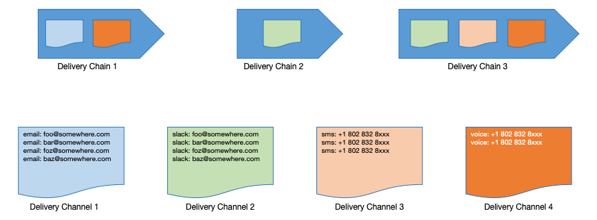
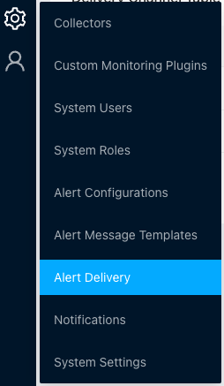
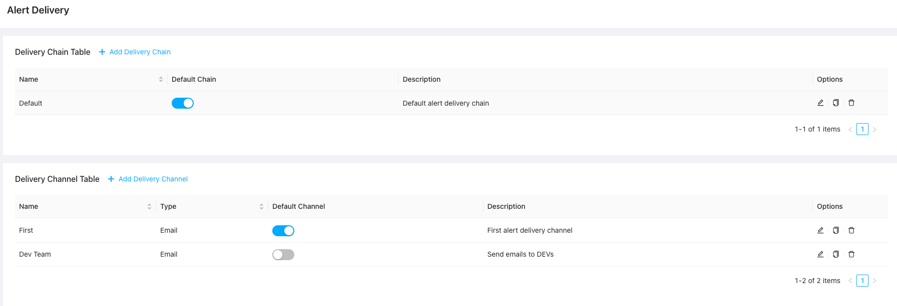
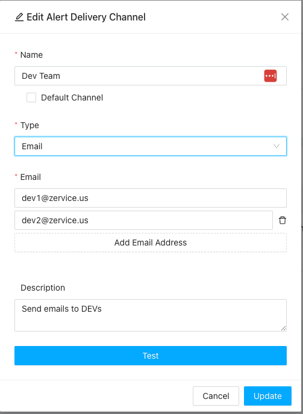
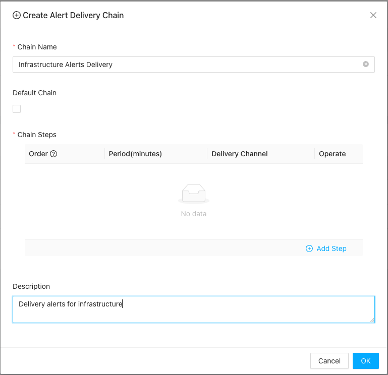
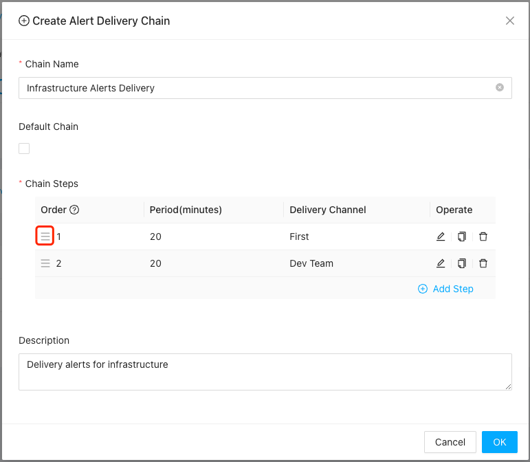
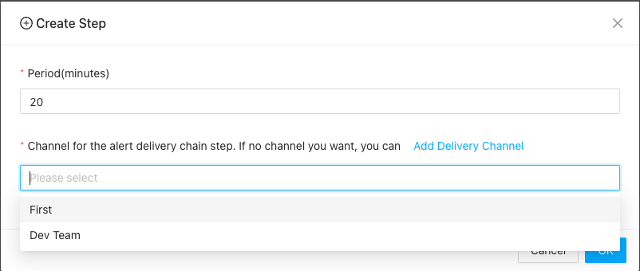

# Alert Delivery

----

In ZoomPhant, alerts are delivered using an **alert delivery chain**. The chain consists of one or more stages, with each stage called an **alert delivery channel**. An alert delivery channel can be included in multiple alert delivery chains. The diagram below provides a high-level overview of alert delivery chains and alert delivery channels:

Here, the user defines a few alert delivery channels, with each channel containing one or more recipients. These channels can then be utilized by one or more alert delivery chains.

### Create an Alert Delivery Channel

Alert delivery channels are the basic building blocks of alert delivery chains. They allow you to group recipients together so you can re-use the same group in different alert delivery chains. 

To create a delivery channel, navigate to the settings page by clicking **Settings** > **Alert Delivery**:

On this page, you can manage all your alert delivery chains and channels:

Click **Add Delivery Channel** to open the **Add Alert Delivery Channel** dialog:  

You will need to provide the following details:
* **Name**: The name of the channel, which will be used when configuring alert delivery chains.
* **Default Channel**: Optionally set this channel as the system default. Only one channel can be designated as the default. The system will use the default channel to route notifications if no specific channel is defined.
* **Type**: The protocol used to transmit the alert. Each channel can only contain recipients of the same type:
  * **Email**: Uses email addresses as recipients.
  * **SMS**: Uses phone numbers to receive SMS messages.
  * **Voice**: Uses phone numbers to receive voice notifications.
  * **Webhook**: Uses custom webhook URLs to receive notification payloads.
    * For convenience, we have pre-configured templates for frequently used webhook services such as Slack, WeChat, etc.
* **Recipients**: Depending on the selected type, enter the email addresses, phone numbers, or webhook URLs.
* **Description**: A short description of the channel's purpose.

After entering the required information, you can click the **Test** button to verify that the recipients receive a test message.

Once created, the alert delivery channel will be available for selection in your alert delivery chains.

### Create an Alert Delivery Chain

When the system generates alerts, it uses alert delivery chains to route notifications. Please refer to [Alert Settings](./alert) to understand how alert delivery chains are assigned to alerting rules.

To create an alert delivery chain, click **Add Delivery Chain** on the **Alert Delivery** page to open the configuration dialog:

Before adding stages or steps, you need to provide the following metadata:

1. **Chain Name**: A name to identify the alert delivery chain across other parts of the system.
2. **Default Chain**: Check this option to make the chain the default. When configuring alerts, you can simply select "Use default" to automatically map to this chain. Only one default chain can exist in the system.
3. **Description**: A short explanation of the purpose of the chain.

Once this information is ready, you can configure your stages or steps. Click **Add Step** to create a new step, or drag and drop existing steps to change their execution order.

#### Rearrange Existing Steps

You can drag the handle icon in the **Order** column to rearrange the steps:

#### Creating a New Step

You can create a new step and append it to the end of the chain by clicking the **Add Step** button:

For each step, you can select one or more channels. The **Period** field determines how long the system waits before escalating the notification from the previous step to the current step.

Once the alert delivery chains are configured, you can proceed to create alerting rules that utilize them.