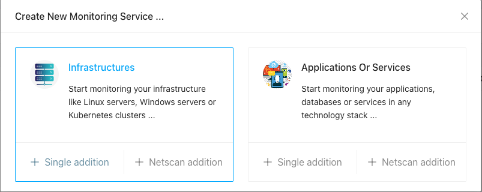
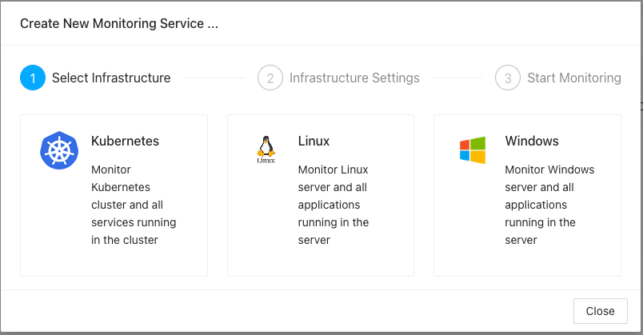
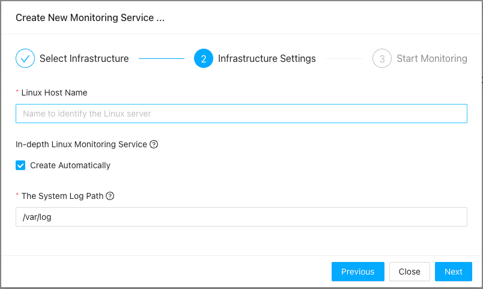
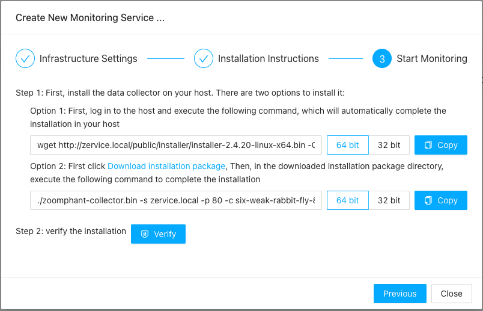
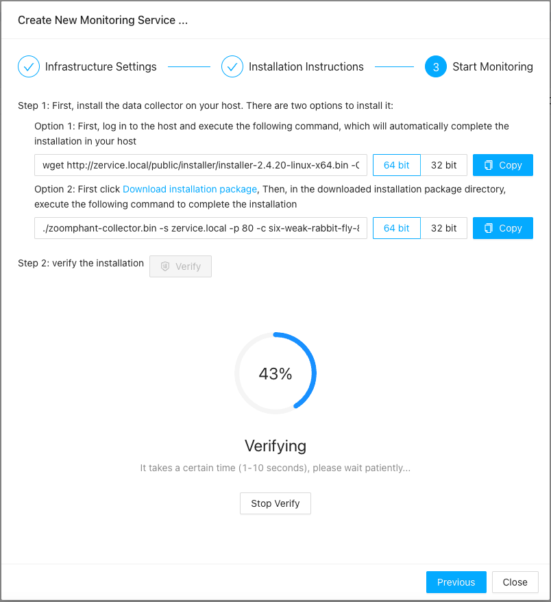

# Data Collectors

----

Data collection is a core function of ZoomPhant, managed by **Data Collection Agents** (often referred to simply as **Collectors**).

In a default ZoomPhant all-in-one installation, a docker-based collector is pre-configured so you can start monitoring immediately. However, you may need to install additional collectors to monitor in-depth infrastructure metrics or segment traffic across different business environments.

---

## Installing Collectors

A collector is a standalone agent package that runs on your infrastructure. To install a collector, download the appropriate package and execute the installation command using the provided parameters. This allows the collector to connect and register with the ZoomPhant server.

Once the collector is running, the host infrastructure itself becomes monitored. In ZoomPhant, this automatically creates a dedicated infrastructure monitoring service.

### Collector Environment Selection

First, determine which collector package matches your underlying host infrastructure. ZoomPhant supports several collector types:

* **Linux Infrastructure Collector**: Designed for Linux and Unix-like systems. It gathers host metrics and runs local check scripts. For installation details, see [Linux Collector](../linux/).
* **Windows Infrastructure Collector**: Tailored to collect Windows-specific performance counters and events. For installation details, see [Windows Collector](../windows/).
* **Kubernetes Infrastructure Collector**: Deployed inside a Kubernetes cluster to collect cluster-wide metrics using native Kubernetes mechanisms. For installation details, see [Kubernetes Collector](../kubernetes/).

*Note: In addition to these system-specific agents, we offer a general Docker-based collector, which only requires a running Docker daemon.*

To begin, click the **Add Monitoring Service** button on the Services panel and choose **Infrastructure**:

Clicking **Single addition** will open the collector installation wizard.

Choose your infrastructure type to proceed to the setup steps. The wizard will guide you through entering basic details, obtaining installation instructions, and verifying the connection. For this guide, we will walk through a **Linux** collector setup.

---

## Collector Installation Wizard

Adding a collector involves three main steps:

1. **Select Infrastructure**: Choose the environment type.
2. **Configure Settings**: Name the collector and configure optional parameters.
3. **Install & Verify**: Execute the installation script and verify the connection.

For details on platform-specific settings, visit the respective guides:
* [Linux Collector](../linux/)
* [Windows Collector](../windows/)
* [Kubernetes Collector](../kubernetes/)

### 1. Select Infrastructure
First, select one of the supported infrastructure types:

Click **Linux** to continue.

### 2. Configure Settings
Provide the configuration details for your collector:

1. **Infrastructure Name**: A unique name to identify the collector and the host in ZoomPhant.
2. **In-depth Monitoring**: Enabled by default. This configures the collector to capture detailed system statistics, which may consume a small amount of additional CPU and memory.

### 3. Install & Verify
The final step provides instructions for downloading and running the agent on the target machine:

For a Linux host, you can choose from two installation options:

1. **Direct Installation**: If the host has outbound internet access, copy and run the one-line command shown in **Option 1**.
2. **Manual Installation**: If the host cannot reach the internet directly, download the installer package first, save it as `zoomphant-collector.bin` on the target host, and execute the command shown in **Option 2**.

*Note: Before copying the command, verify that you have selected the correct CPU architecture (e.g., amd64, arm64) for your system.*

Once you run the installer, click the **Verify** button. The server will wait for the collector to connect and display a success message once the registration is complete:

