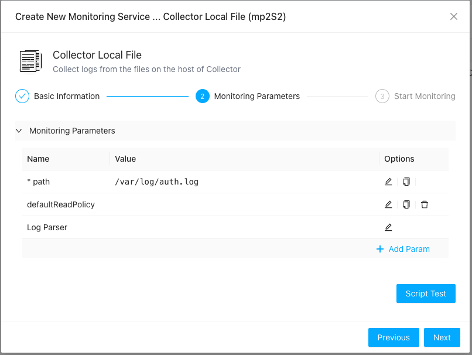
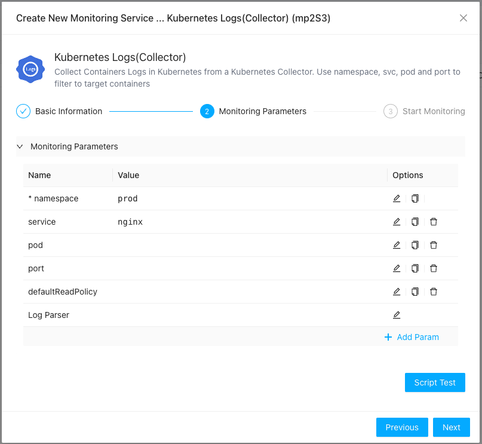

ZoomPhant provides multiple methods for collecting log data.

## Collecting Local Logs

Local logs refer to files that are accessible directly by a ZoomPhant collector (either on a local disk or an NFS-mounted drive). To collect these logs, select **Collector Local File** in the plugin selector when adding a service (see [Adding a Monitoring Service](../../01_service/)) and configure the following parameters:

* **path**: (Required) The file path to the log files. The collector automatically handles log rotation, file truncation, and new file creation.
* **defaultReadPolicy**: Determines where the collector starts reading a new file. Options are `start` (read from the beginning) or `end` (read only new entries). Defaults to `end`.
* **Log Parser**: An advanced option used to specify how log lines should be parsed to extract structured fields (e.g., timestamps, log levels, severity). See [Log Parser](#about-log-parser) below.

---

## Collecting Kubernetes Logs

Collecting logs in Kubernetes can be challenging due to pods migrating between nodes, short-lived containers, and dynamic scaling. ZoomPhant simplifies this by offering native Kubernetes log collection. Before you begin, ensure you have:

1. Installed the ZoomPhant collector in your Kubernetes cluster (see [Kubernetes Collector](../../10_infrastructures/kubernetes/)).
2. Identified the target namespace and pods/services for log collection.

Once these prerequisites are met, select **Kubernetes Logs (Collector)** in the plugin selector and configure the following parameters:

*Note: Make sure you have selected your active Kubernetes collector in the previous step of the wizard.*

* **namespace**: (Required) The Kubernetes namespace of the pods generating the logs.
* **service**: (Optional) The name of the Kubernetes service. If specified, the collector will auto-discover the associated pods, and you can omit the `pod` parameter.
* **pod**: (Optional) The name of the pod, or a RE2 regular expression to filter target pods. This is required if the `service` parameter is left blank.
* **port**: (Optional) If a pod runs multiple containers, specify the port number to target the container associated with that port.

---

## About Log Parser

ZoomPhant supports powerful log preprocessing and extraction using log parsers. Common capabilities include:
* **Redundancy Filtering**: Ignoring redundant log prefixes or headers.
* **Format Conversion**: Transforming structured logs (e.g., converting Kubernetes or Docker JSON log formats into human-readable text lines).
* **Label Extraction**: Extracting custom attributes like log level, severity, or transaction IDs, and mapping the correct log generation timestamp.

Detailed configuration syntax for log parsers will be provided in a separate reference guide.