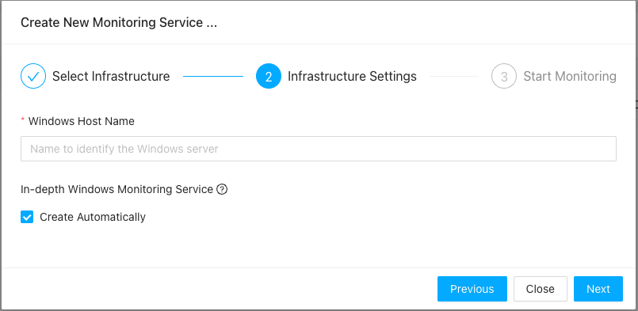
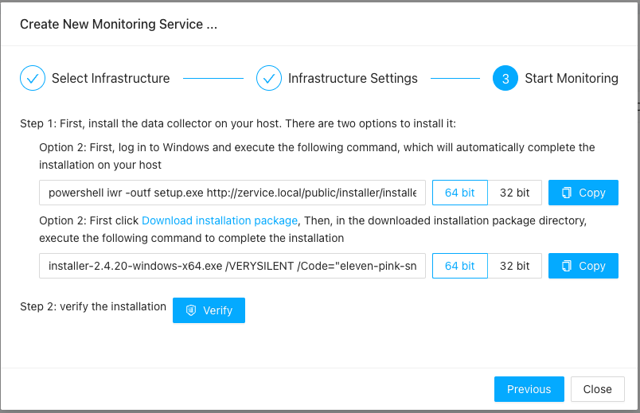
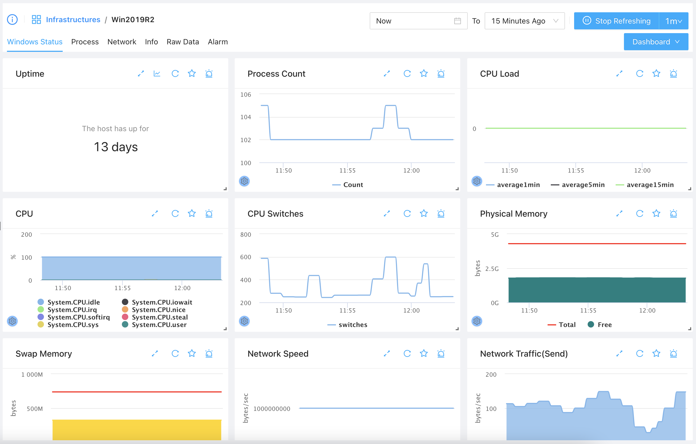
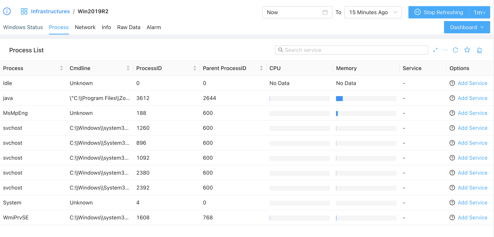
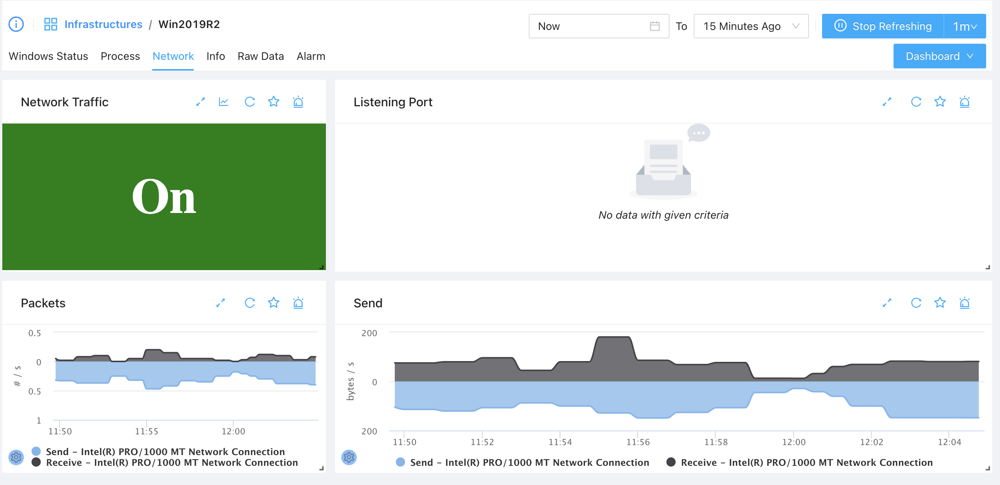

# Windows Monitoring

----
# Windows Monitoring

----
Many enterprises rely heavily on Windows Server for business-critical operations. ZoomPhant supports Windows monitoring natively, providing comprehensive insights out of the box.

To monitor a Windows server, you must first install the Windows collector agent on the target machine. This agent performs general monitoring checks and leverages Windows-native interfaces (such as WMI and PDH performance counters) to gather system metrics.

## Install the Windows Collector

Follow the instructions in [Install Collectors](../collector/) and choose **Windows** as the underlying infrastructure.

In step 2, provide basic information about the Windows system where the collector will be installed:

In step 3, you will be prompted to open a Windows command prompt (`cmd.exe`) and execute the generated installation command:

*Note: If you are using PowerShell, you may need to adjust the syntax or run the command within a standard Command Prompt session.*

---

## Understanding Windows Monitoring Data

Navigate to the newly created infrastructure service to view the default Windows monitoring dashboards:

This dashboard provides a centralized view of the server's health and resource usage.

### Process Monitoring
Switch to the **Process** tab to view the CPU, memory, and status of active running processes:

### Network Monitoring
Switch to the **Network** tab to view the active network interfaces and throughput statistics:

