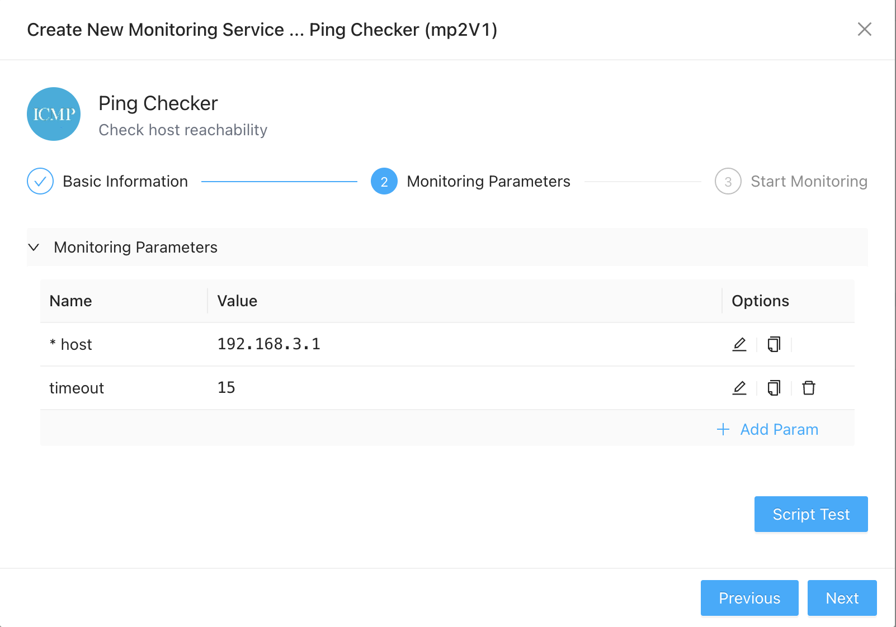
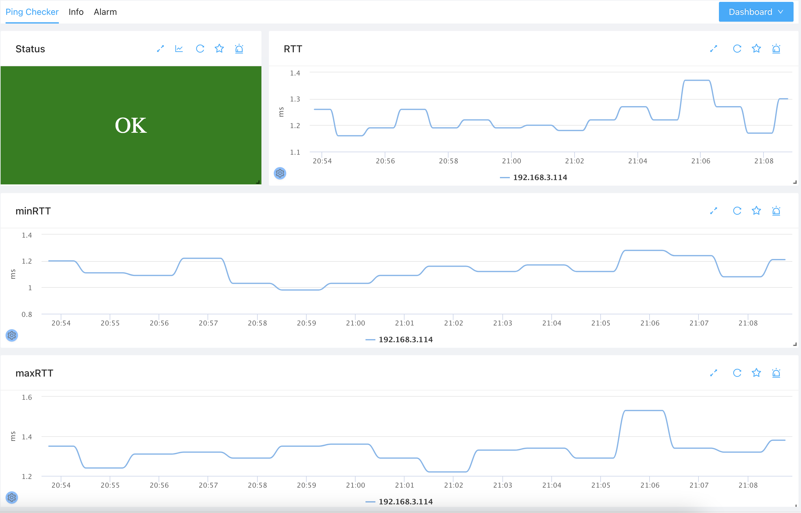
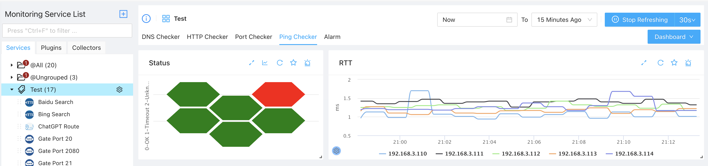

# Ping Monitoring

----
Ping (ICMP) is a standard protocol used to verify if a remote host is reachable and to measure network latency. ZoomPhant provides a simple way to monitor host availability using the **Ping Checker** plugin.

---

## Create Ping Monitoring

To start monitoring a remote host, select the **Ping Checker** plugin from the plugin library. You will be prompted to configure the following parameters:

* **host**: The IP address or domain name of the target device to ping (required).
* **timeout**: The ICMP request timeout in seconds.

Once you have configured the parameters, click **Test** to verify connectivity, and then click **Finish** to add the service.

---

## Understanding Ping Metrics

After adding the service, select it from the service list to view host status and round-trip time metrics:

1. **Overall Status**: The **Status** widget displays `OK` if the target host responds to ICMP requests. If a packet loss threshold is exceeded or the host is unreachable, it will trigger an alert.
2. **RTT (Round-Trip Time)**: The average round-trip latency in milliseconds. Lower RTT is preferred; on local area networks (LANs), RTT is typically under a few milliseconds.
3. **minRTT / maxRTT**: The minimum and maximum round-trip times recorded during the measurement interval, helping you identify packet jitter.

---

## Monitoring Multiple Devices

We recommend creating a separate ping monitoring service for each critical device. You can then monitor the state of all devices in a single view by clicking the **Ping Checker** plugin group tab:

This group dashboard makes it easy to identify unreachable hosts and compare RTT latency trends across all monitored targets.
