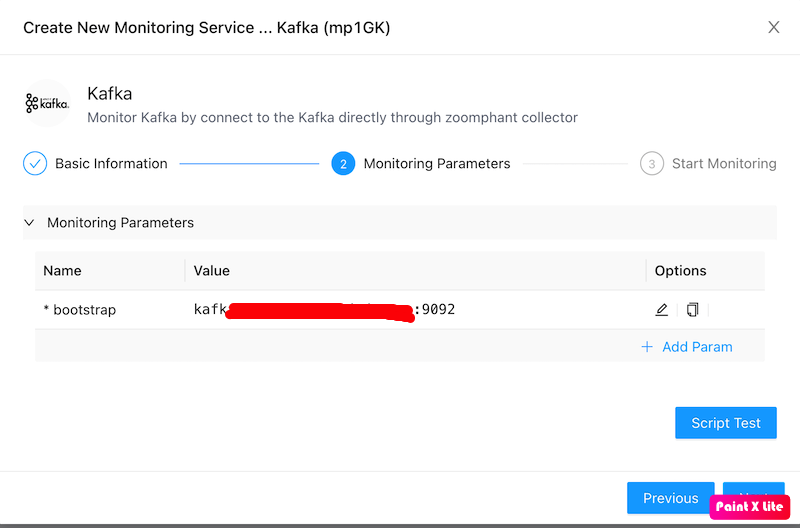
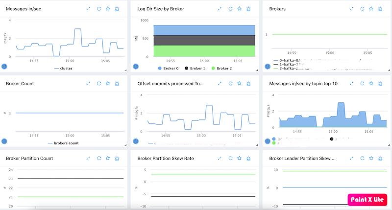
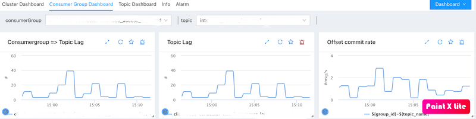
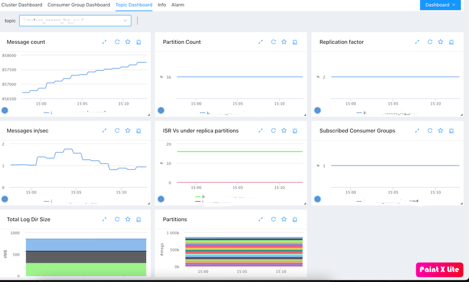

# Kafka Monitoring

----
ZoomPhant provides a straightforward way to monitor one or more Apache Kafka clusters using the **Kafka** plugin.

## Creating a Kafka Monitoring Service

To start monitoring a Kafka cluster, choose the **Kafka** plugin as described in [Add Monitor Service](../../01_service/) and specify the following configuration parameter:

* **bootstrap**: The bootstrap server URLs (e.g., a comma-separated list of `host:port`) for the Kafka cluster.

Once the parameters are set and the service is created, wait a few seconds for data collection to initialize, and the dashboards will begin showing data.

---

## Understanding Kafka Data

ZoomPhant organizes Kafka monitoring metrics into three main dashboards:

### Cluster Dashboard

This view displays the following cluster-level metrics:
- Message input rate at the cluster level.
- Log directory size on disk per broker.
- Broker status and active broker count.
- Top 10 highest offset commit rates.
- Top 10 topics by message input rate.
- Partition count per broker.
- Broker partition skew rate (measuring partition distribution imbalance across brokers).
- Broker leader partition skew rate.

### Consumer Group Dashboard

This view displays the following consumer group metrics:
- Consumer group-level topic lag (unread messages).
- Offset commit rate per consumer group.

### Topic Dashboard

This view displays the following topic-specific metrics:
- Total message count for a topic.
- Partition count for a topic.
- Replication factor for a topic.
- Message input rate per topic.
- In-Sync Replicas (ISR) and Under-Replicated Partitions (URP).
- Number of subscribed consumer groups.
- Log directory size for this topic across brokers.
- Message offset details per partition for the topic.

---

## Monitoring Multiple Kafka Clusters

To monitor multiple Kafka clusters, simply add a separate monitoring service for each cluster.
