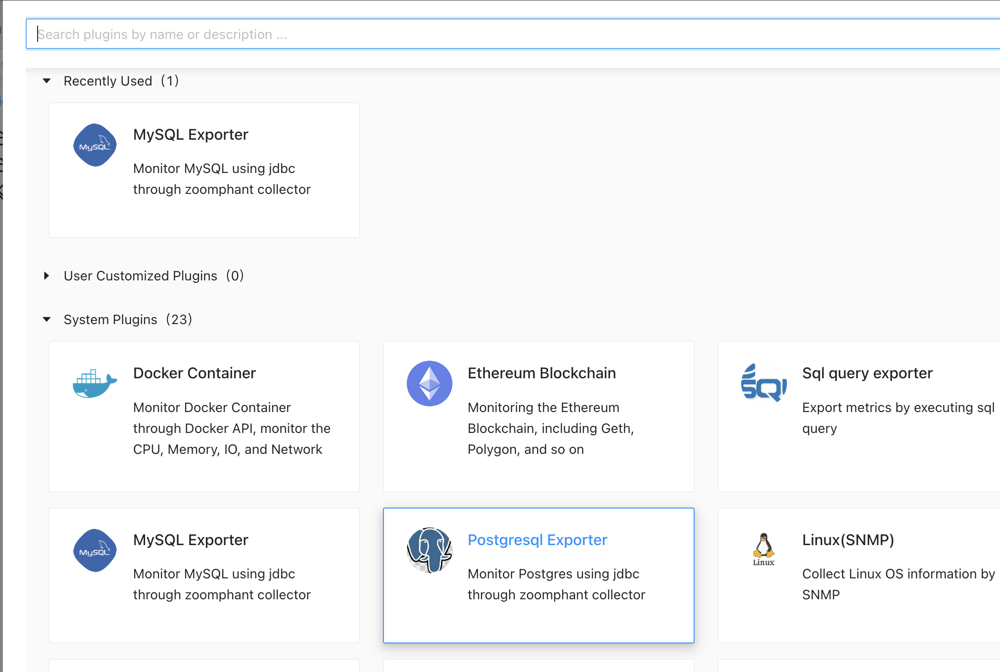

# Postgres exporter

----

ZoomPhant provides an easy way for you to monitor Postgres. 

## Creating Postgres monitoring

To monitor Postgres, you can choose the **Postgresql  exporter** plugin as shown in  [Add Monitor Service](../../01_service/) and provide following necessary parameters to create a monitoring service:

* **jdbc.url**: required. the jdbc url. below are some examples:

  | Database type | jdbc.url example                                             |
  | ------------- | ------------------------------------------------------------ |
  | SQL Server    | jdbc:sqlserver://localhost:1433;databaseName=mydatabase;user=myuser;password=mypassword |
  | MySQL         | jdbc:mysql://localhost:3306/mydatabase                       |
  | Postgres SQL  | jdbc:postgresql://localhost:5432/mydatabase                  |
  | Oracle        | jdbc:oracle:thin:@//localhost:1521/XE                        |
  | Clickhouse    | jdbc:clickhouse://localhost:8123/default                     |

  

* jdbc.user: optional. the jdbc user.

* jdbc.password: optional. the jdbc password.

Note: we will run the sql query in **READONLY** mode to keep your data secure.
