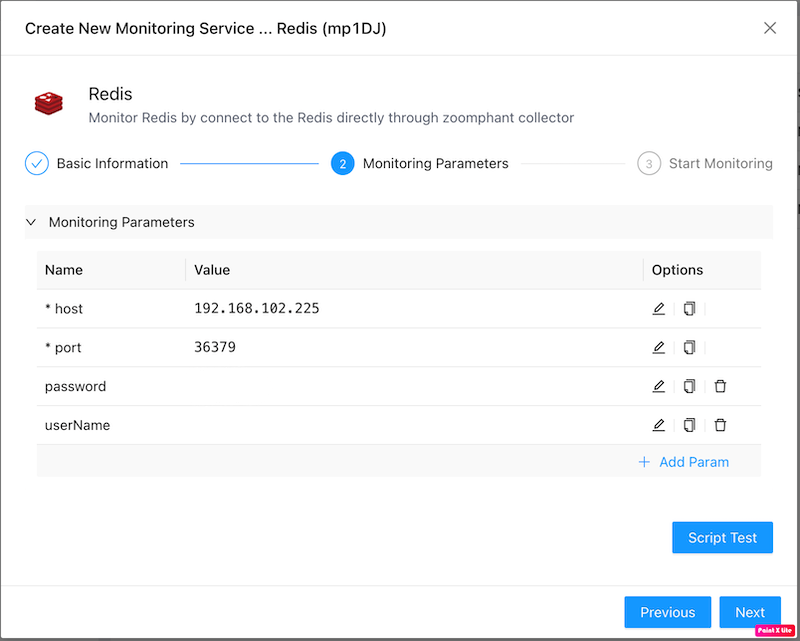
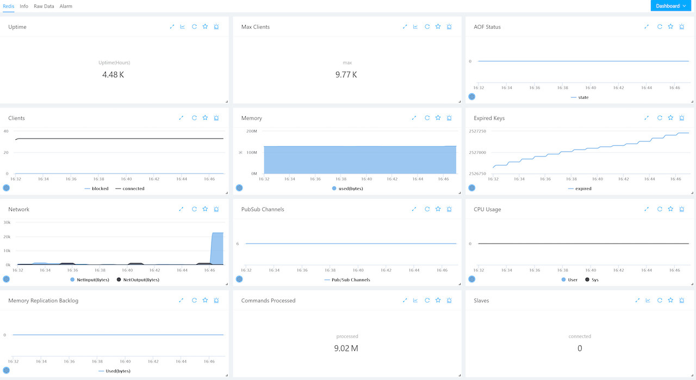

# Redis Monitoring

----
ZoomPhant provides a straightforward way to monitor Redis servers or clusters using the **Redis** plugin.

## Creating a Redis Monitoring Service

To start monitoring a Redis server, choose the **Redis** plugin as described in [Add Monitor Service](../../01_service/) and specify the following parameters:

* **host**: The hostname or IP address of the Redis server.
* **port**: The port number of the Redis server (e.g., `6379`).
* **password**: (Optional) The password required for Redis authentication.
* **userName**: (Optional) The username required for Redis authentication (useful for Redis 6.0 ACLs).

Once the parameters are set and the monitoring service is created, wait a few seconds for data collection to initialize, and the dashboards will begin displaying metrics.

---

## Understanding Redis Data

ZoomPhant organizes Redis performance metrics into an intuitive dashboard layout:

This dashboard includes the following metrics:
- Uptime (in hours).
- Maximum configured clients.
- Append Only File (AOF) status.
- Connected and blocked clients.
- Used memory.
- Expired keys count.
- Input and output network throughput (bytes/sec).
- Publish/Subscribe channels.
- User and System CPU usage.
- Replication backlog memory size.
- Total commands processed.
- Number of connected replicas.