# Create Windows Monitoring Account

----

This document describes how to create a local Windows account on a target machine for monitoring. For official details on WMI access and security, refer to the [Microsoft WMI Documentation](https://learn.microsoft.com/en-us/windows/win32/wmisdk/wmi-start-page).

To monitor a Windows host via WMI, you must configure a user account on the target machine with appropriate permissions. Follow these steps to set up the account.

---

### 1. Create the Local Account

First, create a new local user account on the target host. For this guide, we will use the username **zpmon**:

1. Navigate to **Control Panel** > **User Accounts** > **Manage Accounts**.
2. Select **Add a user account** to create a local user:

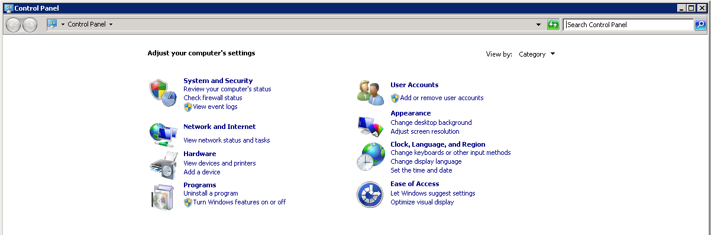

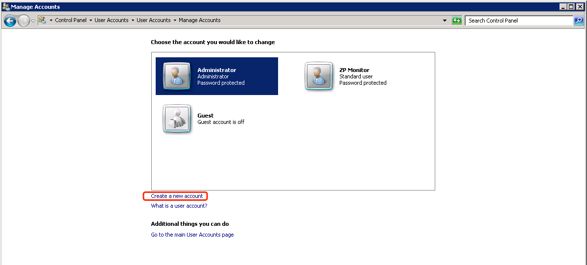

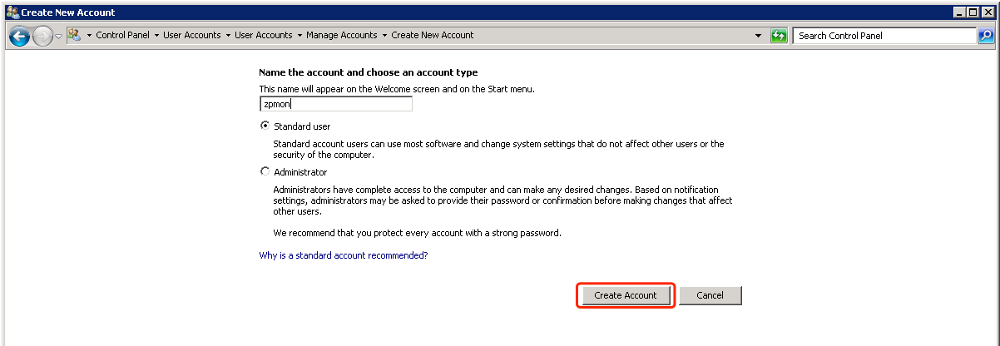

After creating the account, set a secure password for it. You will need these credentials when configuring the WMI monitoring service in ZoomPhant.

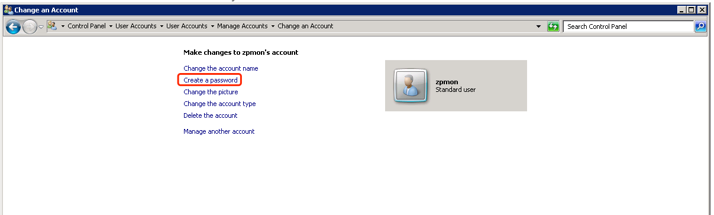

---

### 2. Add the Account to Local Groups

The monitoring user must be added to the following local groups:

* **Distributed COM Users**
* **Performance Log Users**
* **Performance Monitor Users**
* **Remote Management Users**

*Note: Depending on your Windows version, some of these groups might not exist. Add the user to all applicable groups that are available.*

To assign these groups, open **Computer Management** (`compmgmt.msc`) and navigate to **System Tools** > **Local Users and Groups** > **Groups**. Select each group, add the **zpmon** user, and apply the changes:

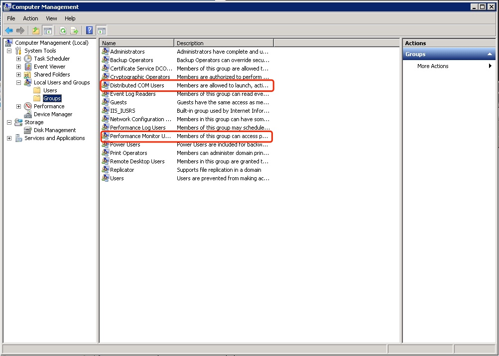

Double-click each group to open its properties, click **Add...**, and enter the user name:

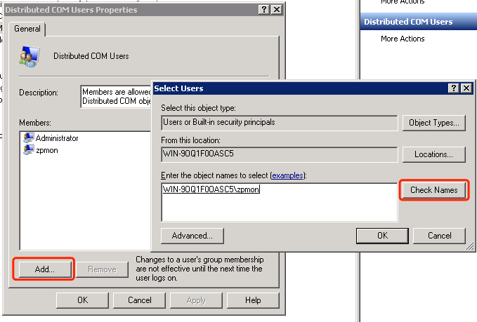

---

### 3. Grant Permissions

You must configure permissions in several system settings to enable WMI access.

#### WMI Namespace Permissions

In **Computer Management**, expand **Services and Applications**, right-click **WMI Control**, and select **Properties**:

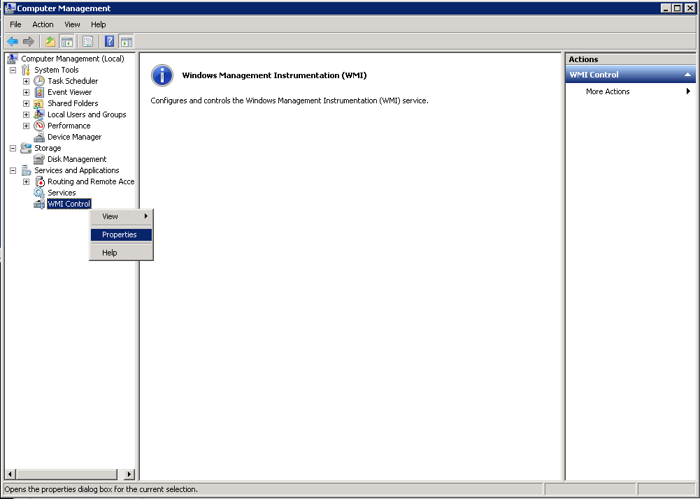

Switch to the **Security** tab, select the root namespace, and click the **Security** button at the bottom:

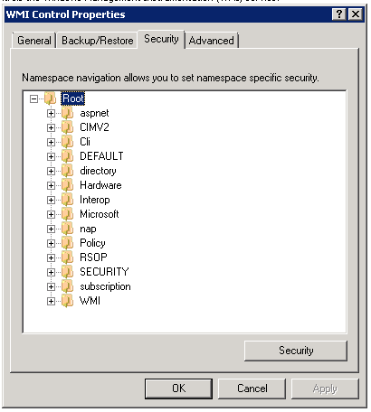

Add the **zpmon** user and enable the following permissions:
- **Execute Methods**
- **Enable Account**
- **Remote Enable**
- **Read Security**

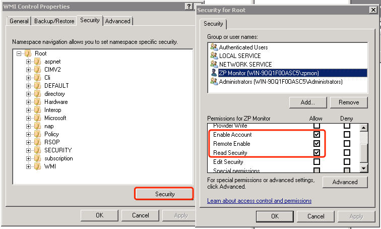

#### DCOM Configuration

WMI uses DCOM (Distributed Component Object Model) for remote queries. You must configure DCOM permissions to allow remote connections. Open the Component Services manager by running `dcomcnfg` from the Start menu.

Navigate to **Component Services** > **Computers** > **My Computer**. Right-click **My Computer**, select **Properties**, and switch to the **COM Security** tab. Click **Edit Limits...** under **Launch and Activation Permissions** and allow Remote Launch and Remote Activation for the user (or a group containing the user):

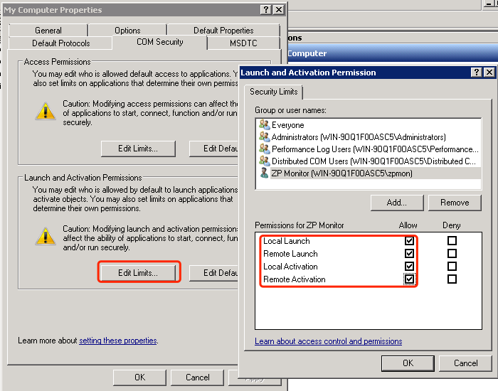

Next, expand **DCOM Config** under My Computer, locate **Windows Management and Instrumentation**, right-click it, and select **Properties**:

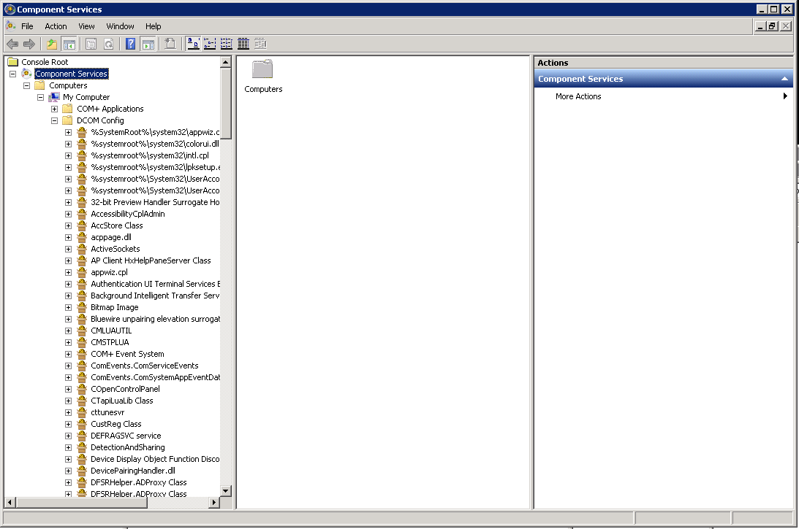

On the **Security** tab, ensure you customize both **Launch and Activation Permissions** and **Access Permissions** to grant the monitoring user remote access rights:

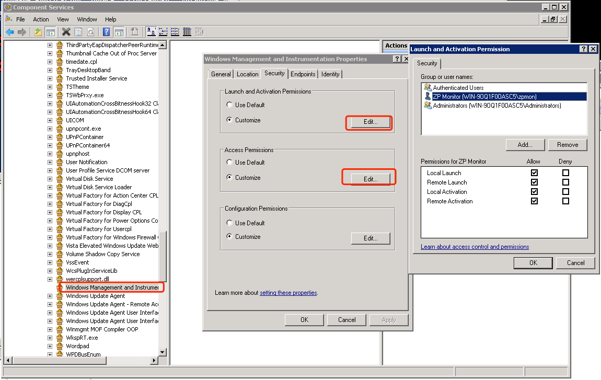

---

### 4. Firewall Settings

Ensure that the Windows Firewall is configured to allow WMI and DCOM traffic. You must enable the following inbound rules:

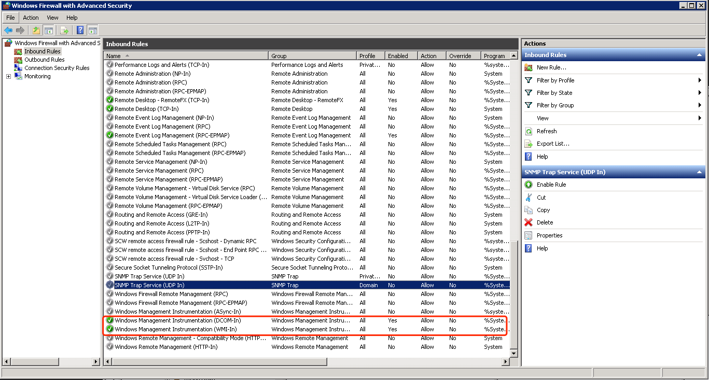

For troubleshooting, you can test connectivity from the collector using utility tools such as `wbemtest` or `wmic` to verify that the credentials and permissions are configured correctly.

