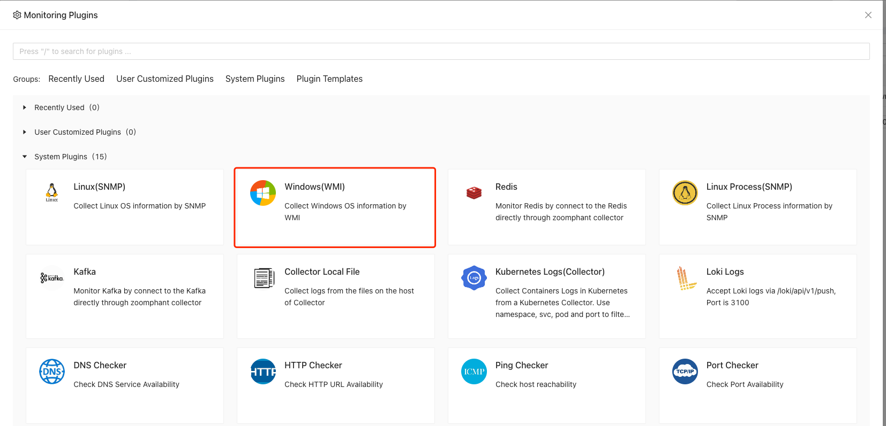
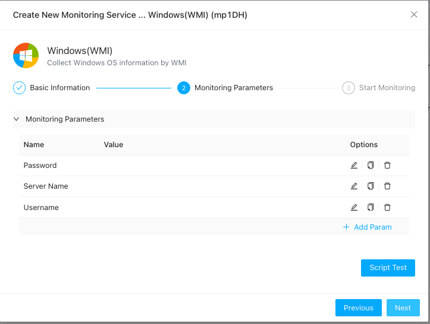
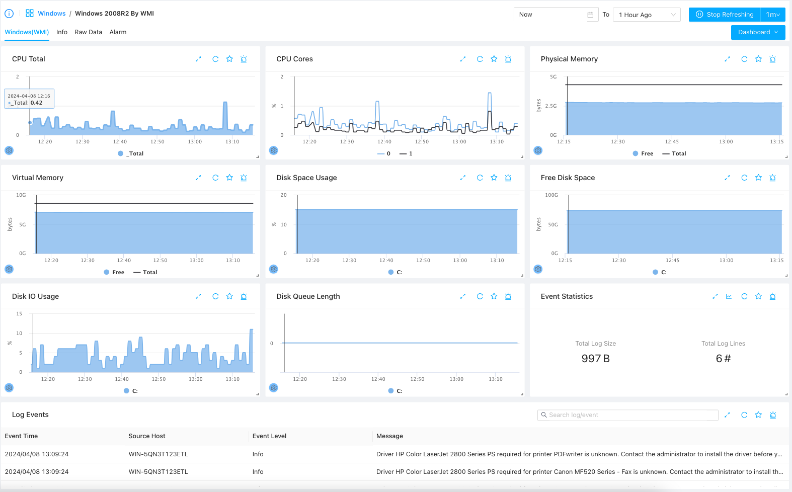

# Windows WMI Monitoring

----

Sometimes, you may want to monitor Windows servers remotely using WMI (Windows Management Instrumentation). You can do this by using the **Windows WMI Monitoring** plugin.

---

## Create Windows WMI Monitoring

To start monitoring a Windows server, ensure you have set up a Data Collection Agent on a Windows host. If not, follow the instructions to [add a Windows Collector](../../10_infrastructures/windows/) first.

Once you have the Windows collector, follow the steps in [Add Monitor Service](../service/) and select the **Windows (WMI)** monitoring plugin:

*Note: Make sure to select a **Windows** collector in the collector selection step.*

Specify the Windows host or domain information along with the username and password to complete the setup:

The following parameters are required:

1. **Server Name**: The hostname or IP address of the remote Windows server.
2. **Username**: The remote user account used to query WMI data.
3. **Password**: The password associated with the username.

Please ensure the configured account has the correct permissions. For detailed steps, see [How to Create a WMI Monitoring Account](./account/).

---

## Understanding Windows Performance Metrics

After adding the monitoring service, wait a few seconds for data collection to initialize. Select the service from the list to view the Windows performance dashboard:

The dashboard displays basic resource utilization metrics as well as major event logs generated during the selected time range.